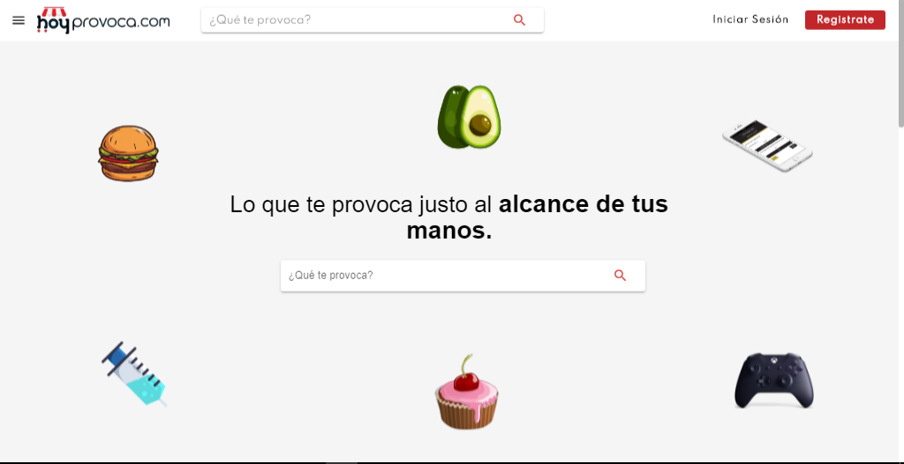
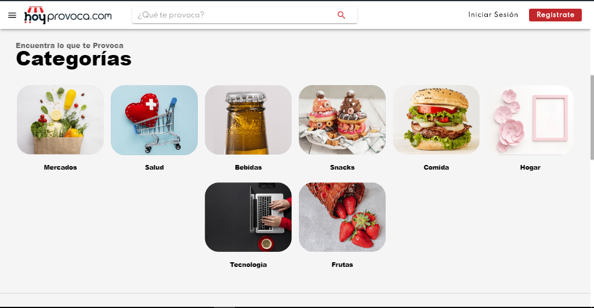
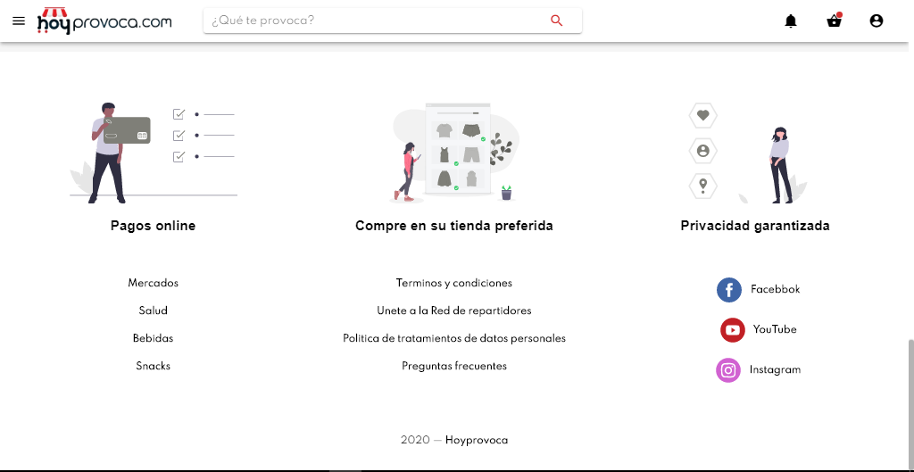
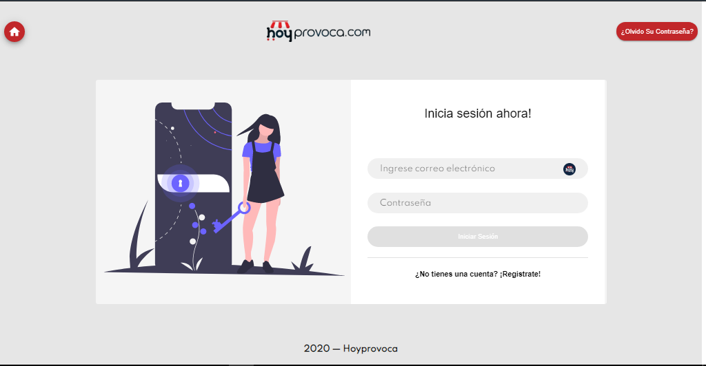
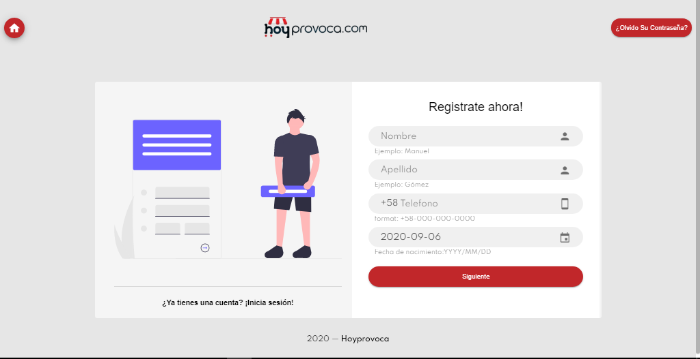

# Hoyprovoca

## English description.

This is a Marketplace-based system with E-commerce functionalities developed during my internships at Somos Sistemas C.A. It is in charge of displaying information on the products and services offered by the companies affiliated to Somos Sistemas C.A, where users can generate orders and request shipments thereof, which is why it represents a tool that facilitates the needs of users. 
this project is still in development.

___

## Descripción en español.

Este es un sistema basado en Marketplace con funcionalidades de comercio electrónico desarrollado durante mis pasantías en Somos Sistemas C.A. Se encarga de mostrar información sobre los productos y servicios ofrecidos por las empresas afiliadas a Somos Sistemas C.A, donde los usuarios pueden generar pedidos y solicitar envíos de los mismos, por lo que representa una herramienta que facilita las necesidades de los usuarios. Este proyecto aún está en desarrollo.

## Index.

***(English)*** Main index of the platform where the most relevant categories are selected in the systems, in addition to the options to log in and selected.

___

***(Español)*** Index principal de la plataforma en donde se muestran las categorías mas relevantes en el sistemas, ademas de las opciones de iniciar sesión y registrarse.

## Auth / Login / Register / Password Recover (Inicio de Sesion, Registrarse y Recuperar contraseña)

### Login / Inicio de Sesion

***(English)*** Dado que es un sistema siempre sera necesario iniciar sesión, aunque en este tipo de sistemas no se requiere iniciar sesión para navegar por ciertas vistas de la plataforma.

___

***(Español)*** Since it is a system, it will always be necessary to log in, although in this type of system, it is not necessary to log in to navigate certain views of the platform.

### Register / Registrarse

***(English)*** In case you want to log in, you are required to register to obtain the necessary information and thus be able to access the service today.

___

***(Español)*** En caso de querer iniciar sesión es requerido que se registre para obtener la informacion necesaria y asi poder acceder al servicio de hoyprovoca.

### Password Recover / Recuperar contraseña

***(English)*** In the event that the user has forgotten their password and thinks that the system is inaccessible, then they do not have to worry, the password can be recovered, since the account has a linked email for these cases.

___

***(Español)*** En el caso de que el usuario haya olvidado su contraseña y piense que el sistema es inaccesible, entonces no tiene que preocuparse, se puede recuperar la contraseña, ya que la cuenta tiene un correo electronico enlazado para estos casos.

